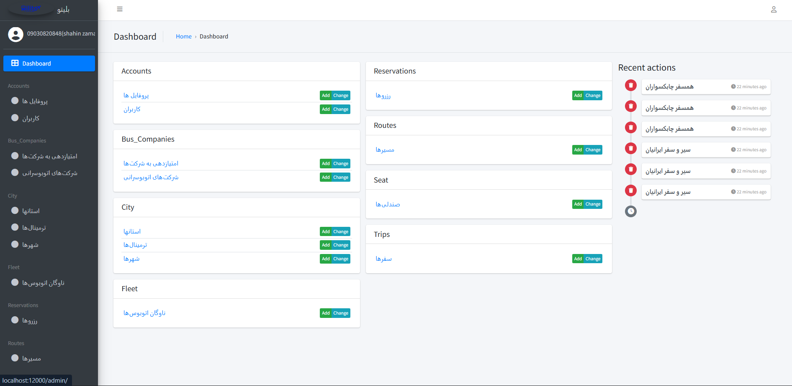
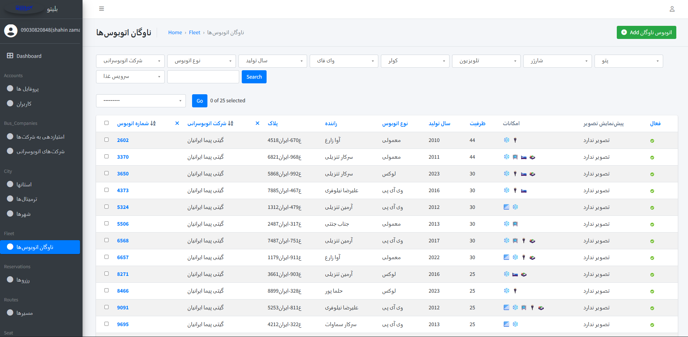
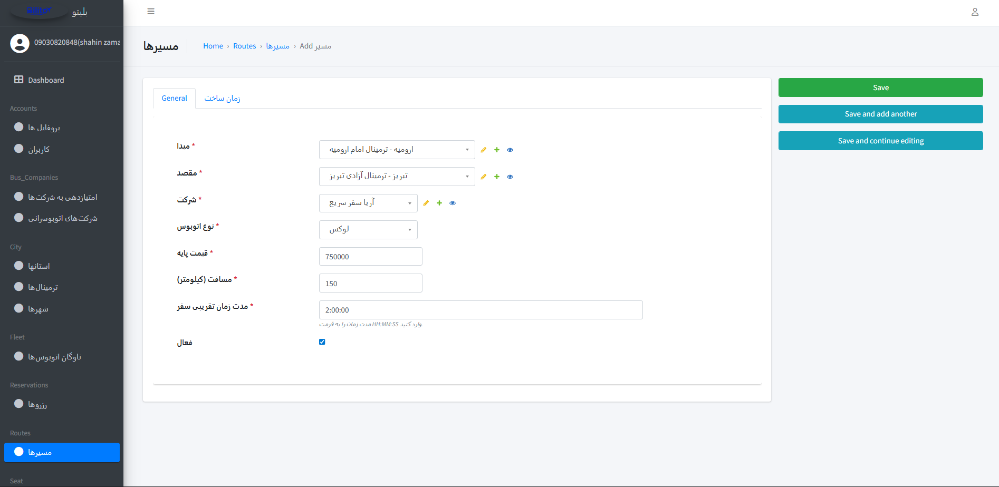
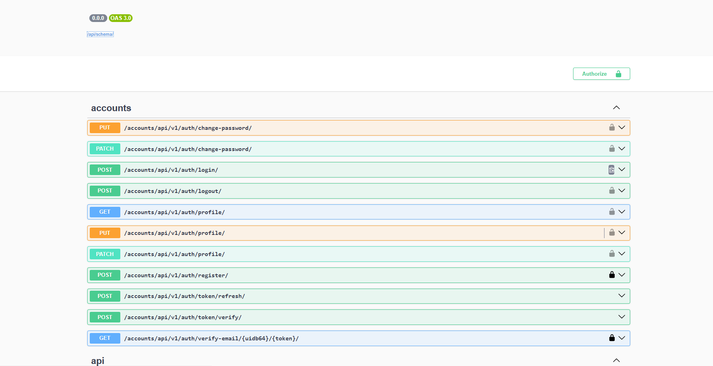
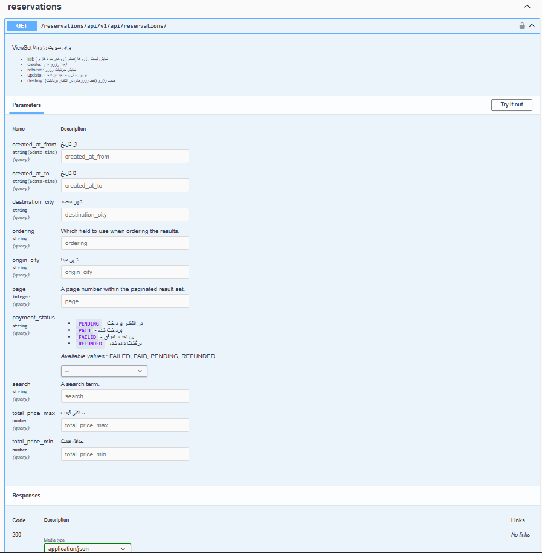
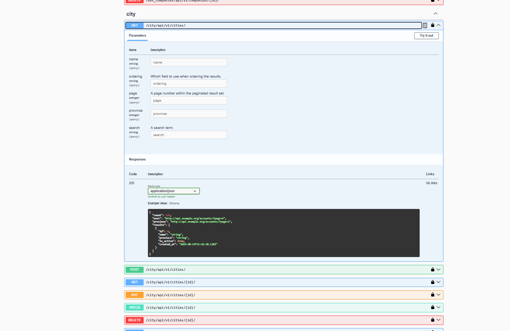

# 🚌 بلیتو (Blito) - سامانه خرید آنلاین بلیط اتوبوس
<div dir="rtl">

## 🌟 درباره بلیتو
بلیتو یک پلتفرم آنلاین و مدرن برای خرید بلیط اتوبوس است که به شما امکان می‌دهد به راحتی و با چند کلیک ساده، بلیط اتوبوس خود را از بین شرکت‌های مختلف اتوبوسرانی رزرو کنید.

### ✨ ویژگی‌های اصلی
- 🎫 رزرو آنلاین بلیط اتوبوس
- 🔍 جستجوی هوشمند مسیرها
- 💺 انتخاب صندلی دلخواه
- 💳 پرداخت امن آنلاین
- 📱 رابط کاربری ساده و کاربرپسند
- 🎯 مقایسه قیمت‌ها بین شرکت‌های مختلف

## Screenshots

### Admin Panel (Jazzmin)

**Dashboard**
نمای کلی از داشبورد پنل ادمین که وضعیت پروژه و آمارها را نمایش می‌دهد.


**List View (e.g., fleet)**
نمایش لیست آیتم‌ها (مانند اتوبوس ها) با قابلیت جستجو و مرتب‌سازی.


**Detail / Edit Form**
فرم جزئیات و ویرایش یک رکورد، شامل فیلدها و دکمه‌های عملیات.


---

### API Documentation (Swagger)

**Swagger UI – Overview**
نمایش کل Endpointهای پروژه با گروه‌بندی و مستندات.


**Endpoint Example – Trips**
نمایش یک Endpoint خاص، شامل پارامترها و توضیحات.


**Try It Out – cities Endpoint**
امکان تست مستقیم Endpointها از داخل Swagger.


## 🚀 راه‌اندازی پروژه

### پیش‌نیازها
- Python 3.8+
- Django
- SQLite (پیش‌فرض)
- pip (مدیریت پکیج‌های پایتون)

### مراحل نصب و راه‌اندازی

1️⃣ کلون کردن مخزن:
```bash
git clone https://github.com/your-username/blito-backend.git
cd blito-backend/core
```

2️⃣ ساخت محیط مجازی:
```bash
python -m venv venv
# در ویندوز
venv\Scripts\activate
# در لینوکس/مک
source venv/bin/activate
```

3️⃣ نصب وابستگی‌ها:
```bash
pip install -r requirements.txt
```

4️⃣ اجرای مایگریشن‌های دیتابیس:
```bash
python manage.py migrate
```

5️⃣ ساخت یک کاربر ادمین:
```bash
python manage.py createsuperuser
```

6️⃣ اجرای سرور توسعه:
```bash
python manage.py runserver
```

حالا می‌توانید به آدرس `http://localhost:8000` مراجعه کنید! 🎉

## 📁 ساختار پروژه
- `accounts/`: مدیریت کاربران و احراز هویت
- `bus_companies/`: مدیریت شرکت‌های اتوبوسرانی
- `city/`: مدیریت شهرها و مسیرها
- `fleet/`: مدیریت ناوگان اتوبوس‌ها
- `payments/`: سیستم پرداخت
- `reservations/`: سیستم رزرو بلیط
- `seat/`: مدیریت صندلی‌ها
- `trips/`: مدیریت سفرها و برنامه‌ریزی

## 🤝 مشارکت
از مشارکت شما در این پروژه استقبال می‌کنیم! برای مشارکت:
1. پروژه را fork کنید
2. یک branch جدید بسازید (`git checkout -b feature/amazing-feature`)
3. تغییرات خود را commit کنید (`git commit -m 'Add amazing feature'`)
4. به branch اصلی push کنید (`git push origin feature/amazing-feature`)
5. یک Pull Request ایجاد کنید

## 📝 لایسنس
این پروژه تحت لایسنس MIT منتشر شده است.

## 📞 تماس با ما
- 📧 ایمیل: support@blito.ir
- 🌐 وبسایت: https://blito.ir
- 📱 تلگرام: @BlitoSupport

## 🎯 شعار ما
> سفری امن و راحت، با یک کلیک! 🚌✨

</div> 