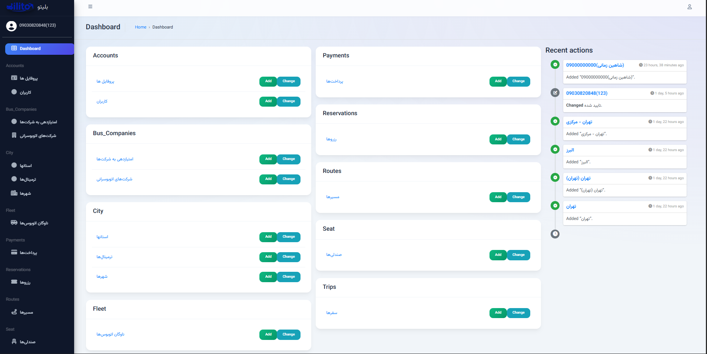
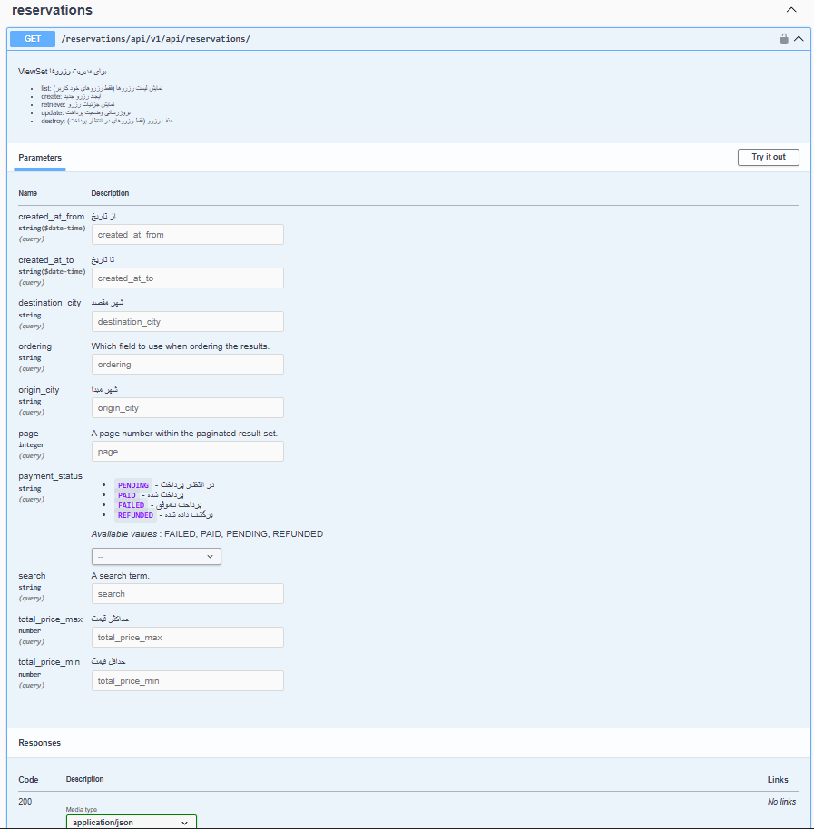
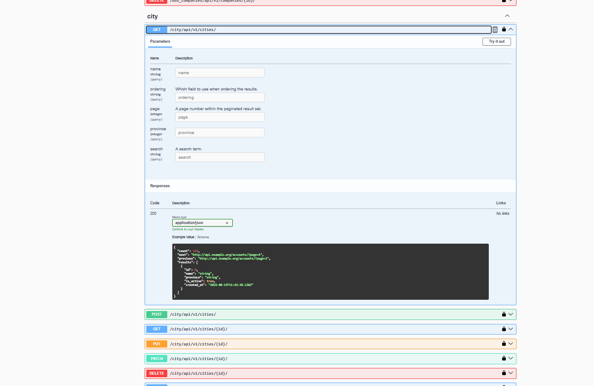

# 🚌 بلیتو (Blito) — سامانه خرید آنلاین بلیط اتوبوس

<div align="center">


</div>

<div dir="rtl">

## 🌟 درباره بلیتو
**بلیتو** یک پلتفرم آنلاین و مدرن برای خرید بلیط اتوبوس است که به کاربران امکان می‌دهد با چند کلیک ساده، سفرها را جستجو کنند، صندلی موردنظر را انتخاب کنند و فرآیند رزرو را به‌صورت آنلاین انجام دهند.

این ریپو مربوط به **Backend** پروژه است و با هدف پیاده‌سازی یک سیستم واقعی و قابل دیپلوی (Production-like) طراحی شده است.

### ✨ ویژگی‌های اصلی
- 🎫 **رزرو آنلاین** بلیط اتوبوس
- 🔍 **جستجوی هوشمند** مسیرها و سفرها
- 💺 **انتخاب صندلی دلخواه** و مدیریت ظرفیت
- 💳 **پرداخت امن** و ثبت تراکنش‌ها
- 🧑‍💼 **پنل ادمین آنلاین** برای مدیریت کامل سیستم
- 📄 **Swagger آنلاین** برای مستندسازی و تست API
- 🐳 اجرای سرویس‌ها با **Docker / Docker Compose**

</div>

## Screenshots

### Admin Panel (Jazzmin)

**Dashboard**
نمای کلی از داشبورد پنل ادمین که وضعیت پروژه و آمارها را نمایش می‌دهد.


### API Documentation (Swagger)

**Swagger UI – Overview**
نمایش کل Endpointهای پروژه با گروه‌بندی و مستندات.


**Endpoint Example – Trips**
نمایش یک Endpoint خاص، شامل پارامترها و توضیحات.


**Try It Out – cities Endpoint**
امکان تست مستقیم Endpointها از داخل Swagger.


## 🚀 راه‌اندازی پروژه (Backend)

> ⚠️ این پروژه بخشی از یک پروژه دانشگاهی است و به صورت **خصوصی** توسعه داده شده است.  
> لطفاً بدون هماهنگی از آن استفاده یا بازنشر نکنید.

---

### ✅ پیش‌نیازها

برای اجرای بک‌اند بلیتو، موارد زیر باید روی سیستم نصب باشند:

- 🐍 **Python 3.8+**
- ⚙️ **pip** (مدیریت پکیج‌های پایتون)
- 🌐 **Django + Django REST Framework**
- 🗄️ دیتابیس پیش‌فرض: **SQLite** (در حالت توسعه)

---

## ⚡ مراحل نصب و اجرا (Development Mode)

### 1️⃣ دریافت پروژه از GitHub
```bash
git clone https://github.com/your-username/blito-backend.git
cd blito-backend/core
```
### 2️⃣ ساخت و فعال‌سازی محیط مجازی (Virtual Environment)
```bash
python -m venv venv
```
### فعال‌سازی محیط مجازی

* در ویندوز:

```bash
venv\Scripts\activate
```
* در لینوکس / مک:
```bash
source venv/bin/activate
```
---

## 3️⃣ نصب وابستگی‌ها

```bash
pip install -r requirements.txt
```

---

## 4️⃣ اجرای Migration دیتابیس

برای ساخت جدول‌های اولیه:
```bash
python manage.py migrate
```
---

## 5️⃣ ساخت کاربر ادمین (پنل مدیریت)
```bash
python manage.py createsuperuser
```
---

## 6️⃣ اجرای سرور توسعه
```bash
python manage.py runserver 0.0.0.0:9000
```
---

## ✅ دسترسی پس از اجرا

بعد از بالا آمدن سرور، بک‌اند از طریق آدرس‌های زیر در دسترس خواهد بود:

* 🌍 Backend API
  http://localhost:9000/

* 🧑‍💼 Django Admin Panel
  http://localhost:9000/admin/

* 📄 Swagger API Docs
  http://localhost:9000/swagger/

## 📁 ساختار پروژه
- `accounts/`: مدیریت کاربران و احراز هویت
- `bus_companies/`: مدیریت شرکت‌های اتوبوسرانی
- `city/`: مدیریت شهرها و مسیرها
- `fleet/`: مدیریت ناوگان اتوبوس‌ها
- `payments/`: سیستم پرداخت
- `reservations/`: سیستم رزرو بلیط
- `seat/`: مدیریت صندلی‌ها
- `trips/`: مدیریت سفرها و برنامه‌ریزی


.

## 📞 تماس با ما
- 📧 ایمیل: support@blito.ir
- 🌐 وبسایت: https://blito.ir
- 📱 تلگرام: @BlitoSupport

## 🎯 شعار ما
> سفری امن و راحت، با یک کلیک! 🚌✨

</div> 
